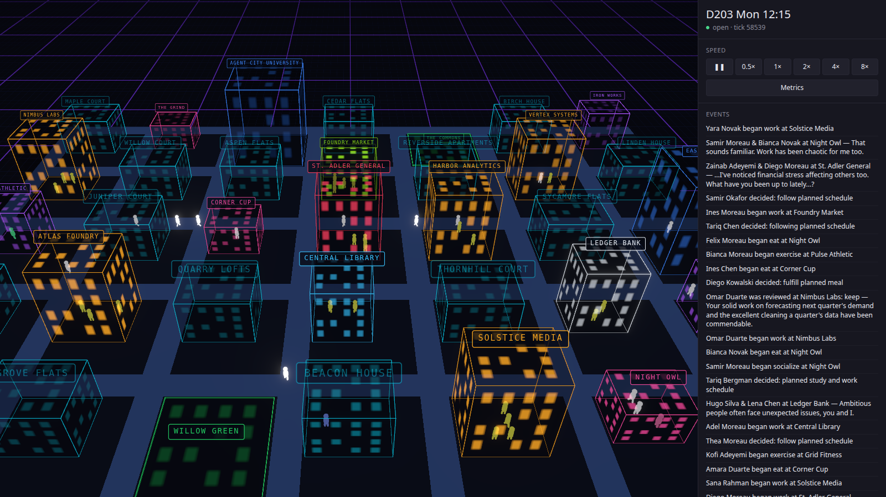
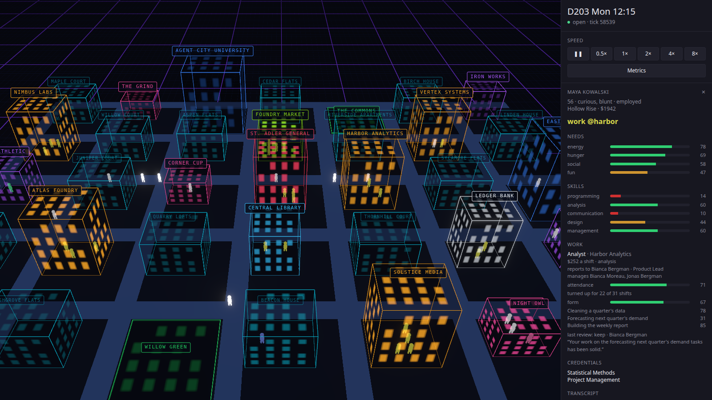

# Agent City

A living city of 50 LLM agents who study at university, interview for jobs, get
hired, and work under a management hierarchy — running entirely on a single
consumer GPU, with no cloud API.



*Day 203 of the recorded live year, replayed. Every line of dialogue and every review in the feed was written by the model.*

> **Status: Phase 8 complete.** Fifty agents study, interview, work, borrow, are
> reviewed, promoted and retired, and go over their days at night — all on a local
> 3B model, admitted through a cognition scheduler that rations a measured GPU
> budget. A full year has been lived with the model on, recorded, and replayed
> exactly. The roadmap marks what exists.

## The constraint that shapes everything

Fifty agents that each "think" every tick would need 50 LLM inferences per
second. A single RTX 5060 Ti delivers barely more than one. Measured on the
target hardware:

| Lane | Model | Latency | Slots | Throughput |
|---|---|---|---|---|
| Fast — plans | `qwen2.5:3b` | ~2.4s | 2 | 0.83 calls/sec |
| Smart — dialogue | `qwen2.5:3b` | ~1.5s | 1 | 0.67 calls/sec |

Measured end to end that is **1.32 completed calls per second** — about 190 per
simulated day against a demand of roughly 540. The city asks for three times what
the card can deliver. The scarcity is the design problem, and every architectural
decision here follows from it.

Free API tiers were evaluated and rejected: Groq's free tier caps at 6,000
tokens/min (~7 usable calls/min with realistic prompts) and Gemini Flash at
1,500 calls/day. Both are 15–30x *slower* than the local GPU, and would reduce a
2.4-minute simulated day to over an hour.

## The design rule

**The simulation owns the numbers. The LLM owns the language and the judgment
calls.**

Skills, money, exam scores, task output, review verdicts and promotions are
computed deterministically in Python. The model writes dialogue, daily plans,
exam papers, interviews and hiring verdicts, and the words of every review —
always conditioned on state that is actually true. A
candidate whose Python skill is 35/100 is prompted to answer *as someone at
35/100*, so a weak agent gives genuinely weak answers, the interviewer scores
them low, and the rejection is earned rather than roleplayed.

This keeps the city coherent, cheap, and replayable.

### Tiered cognition

| Tier | Runs on | Cost | Frequency |
|---|---|---|---|
| **0 — Reflex** | Pure Python | free | Every agent, every tick |
| **1 — Fast** | `qwen2.5:3b` | 2 slots | Daily plans |
| **2 — Deliberate** | `qwen2.5:3b` | 1 slot | Conversations, exams, interviews, reviews, reflection |

Tier 0 is what makes the city look continuously alive: needs decay, path
following, action execution, and critical-need overrides. No agent ever blocks
waiting on a model.

The cognition scheduler admits Tier 1/2 requests by priority within a per-tick
budget; anything that doesn't win a slot degrades to Tier 0 and re-asks next
tick with a priority that has risen slightly. Measured over two simulated days
with 50 agents: **2.5 plans and 3.1 conversations per agent per day, 0 dropped as
stale, 0 failed, 0 errors** across a thousand generations. Most agents are on
Tier 0 at any instant, and that is the design working rather than a shortfall —
the GPU affords barely more than one inference a second and reflexes carry
everything between.

## Roadmap

| Phase | Scope | Status |
|---|---|---|
| 0 | World grid, A* pathing, needs, actions, tick loop | ✅ Done |
| 1 | FastAPI + WebSocket, Three.js renderer, time controls | ✅ Done |
| 2 | Memory stream, LLM client, tiered scheduler, daily plans | ✅ Done |
| 3 | Co-location conversations, relationships, event feed | ✅ Done |
| 4 | University: courses, exams, skill growth, credentials | ✅ Done |
| 5 | Companies, job postings, LLM interviews, hiring | ✅ Done |
| 6 | Org hierarchy, task assignment, reviews, promotions | ✅ Done |
| 7 | Reflection, deterministic replay, metrics dashboard | ✅ Done |
| 8 | Bank, public money, floor job, replay viewer, a year lived | ✅ Done |

## Running it

Requires Python 3.11+, Node 20+, pnpm, and [Ollama](https://ollama.com)
(Ollama is unused until Phase 2).

Ollama must be allowed to serve more than one request at a time, or the lanes
are a fiction — see the design note below:

```bash
OLLAMA_NUM_PARALLEL=2 ollama serve
```

```bash
cd backend
python3 -m venv agent-city-env
source agent-city-env/bin/activate
pip install -e .
```

Run the city headless for two simulated days:

```bash
python -m app.sim.loop
```

```
576 ticks (2 sim-days) in 0.14s -> 4,167 ticks/sec
clock: D2 Wed 06:00
doing now: {'travel': 29, 'sleep': 8, 'exercise': 7, 'eat': 5, 'socialize': 1}
path cache: 77% hit (587/178)
```

Simulating 50 agents costs ~0.24 ms per tick — roughly 14 simulated days per real
second. The simulation is free; only thinking is expensive.

To watch it live, run the server and the frontend in two terminals:

```bash
cd backend && uvicorn app.net.server:app --port 8000
```

Not `--reload`: uvicorn watches the working directory, and any `.py` file created,
moved or edited there restarts the app — and the city with it, from tick 0,
silently. `AC_TERM_DAYS=4` shortens terms for measurement runs; the default is 14.
`AC_DAYS_PER_YEAR=1` ages the city a year a day, so retirement can be watched in
about a minute; the default is 14.

Every live run is written to `replays/`, under wherever the server was started,
at about 50 KB a sim-day with the model on (`AC_RECORD=0` turns it off). Replay
one headless, with no GPU:

```bash
cd backend && python -m app.sim.replay replays/run-20260925-213129.jsonl
```

Point the server at a recording instead and the browser plays it back — the same
city, no GPU, nothing re-recorded, paused at the last frame:

```bash
cd backend && AC_REPLAY=../replays/run-20260927-060339.jsonl uvicorn app.net.server:app --port 8000
```

```bash
cd frontend && pnpm install && pnpm dev
```

Then open `http://localhost:5173`. Drag to orbit, scroll to zoom, click any
agent to inspect their needs, skills, current action, and who they know — each
relationship showing how often they have met, how they feel about each other, and
the last thing that was said. Students also show their course, attendance,
credentials, and their last few exam papers. Anyone with a job shows the role,
the employer, what it pays a shift, how many shifts they have turned up for, who
they report to and who reports to them, their form and last three tasks, their
last review, and whether they are on a course the employer is paying for, ready
for the seat above, or carrying a warning; anyone who owes Ledger Bank shows how
much, and a porter's job is marked as minimum-wage work they are still looking to
leave; anyone walking to an interview shows where they are going.



The **Metrics** button under the speed controls swaps the city for a dashboard:
headline numbers, then a chart per question over sim-days — who is employed,
attendance, the job market, careers, money, friendships, and what the model did
each day — with every morning also available as a table.

## Architecture

```
backend/app/
  config.py        Every tuning knob: pacing, cost, scale
  sim/             70x50 grid, city layout, A* pathing, clock, tick loop,
                   replay (fingerprint, recorder, replayer), metrics
  agents/          Agent state, needs, skills, actions, relationships
  cognition/       Memory stream, LLM client, scheduler, prompts   (Phase 2)
  institutions/    University, companies, job market, hierarchy, bank, government (Phases 4-6, 8)
  net/             FastAPI, WebSocket broadcast, control API
frontend/src/
  components/      Metrics dashboard
  render/          Three.js scene, buildings, agent figures, bloom
  state/           WebSocket client, snapshot store
```

## How an agent thinks

An agent **asks** to think; the scheduler decides who actually gets to. Fifty
agents ask roughly 500 times a tick and about 1 is admitted — a ~2% admission
rate that is the whole point, not a fault.

An admitted thought runs entirely off the tick path:

1. **Embed** any memories still carrying a placeholder vector — batched, because
   one embedding costs ~209ms of round trip while thirty-two cost 90ms in total.
2. **Retrieve** with relevance gating the candidate set and recency plus
   importance ordering what is already on topic, each component min-max
   normalised across the candidates and anything below 85% of the best match
   dropped rather than padding the result out.
3. **Prompt** with a closed vocabulary — the model chooses from real actions at
   legal places, because a 3B model will otherwise happily invent
   `"search_for_restaurant"`.
4. **Validate** the reply against that vocabulary. Malformed steps are dropped
   and an empty plan simply means Tier 0. A bad generation can never stall an
   agent.

The simulation never awaits a model. Requests are fire-and-forget, answers apply
on whatever tick they land, and anything older than its staleness window is
discarded rather than acted on.

## How two agents talk

Conversation is mostly free. Two agents in the same building acknowledge each
other, feel slightly less alone, and drift together or apart according to
temperament — pure Python, every tick, no model involved. Measured at **1.54
encounters per tick** against a budget of **0.27 generated conversations**, so
about one in five can afford words. The greeting is not a fallback; it is what
happens to the overwhelming majority, and the city looks sociable because of it.

Which encounter gets words is scored *before* the greeting, not after. `greet()`
stamps `last_talked_tick` and increments `times_met` — the very facts the score
reads — so the reverse order makes every pair look like acquaintances who just
spoke. First meetings dominate at 6.0; known pairs score on time apart and
strength of feeling. The gate sits at 2.0, in the valley of a bimodal
distribution, leaving 0.61 candidates per tick against 0.27 slots. That
oversupply is deliberate: refusing a candidate costs nothing, since it still gets
the greeting, while an idle slot is GPU thrown away.

Conversations bypass the plan scheduler entirely. A refused plan re-asks next
tick at a higher priority; a refused encounter is simply gone, because the
greeting has already put that pair on a three-hour cooldown. There is no queue to
be fair about — only a choice of which of this tick's pairs is worth words.

The whole exchange is one generation rather than one per turn, and the simulation
decides what it changed: warmth moves affinity by at most a few points, so a
single conversation can *start* a friendship and never manufacture one. Who ends
up close stays mostly a matter of who keeps turning up. Affinity reaches +26 by
day 6, with friendships forming and nothing forced.

Each exchange is stored as a memory at importance 4.0, above an observation. That
one decision is what makes conversations compound — the next one remembers the
last through ordinary retrieval, with no extra plumbing anywhere. Agents visibly
relay third-hand news:

> **Diego Rahman:** Same, and Nadia mentioned you're a bit lost around here.
>
> **Rin Haddad:** Hey Hugo, seen Elias? He looks stressed.

Nobody wrote a gossip system. It falls out of dialogue being a memory.

## How a student learns

Fifteen agents start enrolled — the `initially_students` fraction that had been
dead config since Phase 0. Six courses across two campuses, four sessions a week
each, fourteen-day terms. A timetable is an external obligation rather than an
appetite, so it is its own layer in `_choose_action`: above needs, below a
critical one. An agent about to collapse from hunger does not keep a study
appointment.

Getting them into the room took four measured passes. The timetable alone gave
**0.21** attendance, and the breakdown was exact: 43.8% asleep, 34.4% travelling,
21.9% free — and 21.9% attended. A bedtime routine for students only (nobody
unenrolled has a reason to prefer the night) took it to 0.56. Turning a journey
around when class opens — the narrowest useful exception to actions having
duration, since nobody is committed to the middle of a walk — took it to 1.00,
which is degenerate: an exam has nothing to examine when everyone attended
everything. Trait-driven skipping brought it back down. `diligence()` is not a
dimension the agents were given; it falls out of the traits they already have, so
a failed course traces back to who someone is rather than to a number invented
for the university. Measured attendance sits near **0.70** against a predicted
mean of 0.75.

The register is signed by whoever sent the agent, not by the clock when they
arrive. Journeys run a median 65 sim-minutes against a 60-minute join window, so
checking the timetable on arrival marked almost everyone absent — attendance fell
to 0.01 and the city stopped graduating. Skill grows from any study at the
campus; only a session the timetable dispatched can sign the register, which is
what stops the plan layer forging it.

Exams are one generation. The model writes the question, the student's answer, a
mark and an examiner's comment, anchored to the mark the simulation has already
worked out from skill and attendance — its job is to write an exchange that reads
like that number, not to invent an outcome. The answers are calibrated without
being told how:

> **Applied Programming** — *Write a simple function that takes two numbers and
> returns their product.*
>
> I made a mistake I tried to multiply the numbers but I wrote it as an addition.
> So, if you give me two numbers, like 4 and 5, I would write 9 instead of 20.

> **Statistical Methods** — *Calculate the mean of 5, 10, 15, 20, 25.*
>
> To find the mean I add all the numbers and then divide by how many numbers
> there are. So, it's (5+10+15+20+25) / 5 = 45 / 5 = 9.

Nobody asked for arithmetic errors. A student who sets the method up correctly
and botches the addition is what a weak paper looks like.

Thirty of thirty papers are model-graded, with zero timeouts and zero unusable
replies. The pass mark was read off the measured distribution rather than chosen:
**36** puts 47% of first attempts through and 72% within the two the design
allows, and it sits in a flat stretch of the curve, so a run that comes out
slightly differently moves the rate by a few points rather than twenty. Samir
Iyer failed Project Management with 14 having attended none of three sessions,
then passed the retake with 57 having attended both. That arc is in his
transcript; nobody wrote it.

Money moves too. Rent falls on everyone at midnight, tuition on students, a
stipend to the unemployed, and a meal costs the moment it starts. Wages arrived
with Phase 5, but they are paid on a finished shift and a student works none, so
a term is a fortnight of outgoings against no income: balances go negative and
running out of money is a milestone, at the same importance as a result. Measured at day 8: students
had spent 762 against the employed's 622, and every part of the gap is
accounted for — the seed dealt the fifteen students a poorer hand at spawn,
tuition outran the stipend by 40, and a student eats about one meal a day more
than anyone else, because the daytime-nap guard sends them to the cafe when
hunger is merely the lowest thing left.

## How someone gets a job

Eleven employers carry forty-one seats across sixteen roles. Like the
curriculum, the postings are fixed data — an advert reads the same on Tuesday as
it did on Monday, and a wage is a number, so the simulation owns both. What the
model owns is the interview.

A role names the skill it draws on, the standing it wants at the door, the days
and hour of its shift, and what it is worth per sim-day of living. The shift wage
derives from that last figure rather than being set directly, so a six-day job is
not secretly richer than a five-day one advertising the same money. Against a
measured cost of living near 78 a day, a stall hand at Foundry Market clears it
by nine and a control engineer at Kestrel Power Station by a hundred and twenty.
The top of the market is out of reach at spawn by construction — nobody is dealt
programming 55 — so the Product Lead seats stand visibly empty until the
university produces someone who can fill them.

The rule that makes an interview worth holding:

> The simulation decides who gets into the room. The model decides what happens
> in it.

The door is deterministic. Standing is raw skill plus ten points for a credential
in the subject, and below the posting's requirement a candidate is turned away at
reception without a generation being spent. That is what makes rejection
*reliable*: a model asked to judge everyone lets a weak candidate through on a
good roll, and then nobody ever needs to go back and study. Above the bar the
verdict is the model's and is **not clamped** — unlike the exam mark, which is
held inside a band around the number the simulation already worked out.

One generation writes the question, the candidate's answer at their stated
ability, the verdict and a reason. Writing the answer is the mechanism: the model
is never asked whether 47 out of 100 is good enough, it is asked to write what a
47 says and then react to what it wrote.

> **Junior Engineer, Solstice Media** — *Given a list of integers, find the two
> numbers such that they add up to zero.*
>
> Sure, let's say we have an array like [-3, -1, 2, 0]. The pair that adds up to
> zero would be (-3, 3).

Three is not in that array. Sana Rahman was turned down for it and enrolled in
Algorithms.

**The first version rejected sixteen of eighteen candidates** — not on judgement
but on framing. The prompt handed over *"the job needs programming of at least 30
out of 100; theirs is 47 out of 100"*, and 47 out of 100 is a failing grade in
almost every context a language model has read. The job needing 30 does not
rescue it. Taking the raw scale out of the facts — *"asks for 30, theirs is 47,
comfortably clear of what the job asks"* — and stating the one fact the prompt had
been leaving out, that everyone who reaches the room has already cleared the bar,
moved the hire rate from **0.11 to 0.60** with nothing else touched. The scale
stays in the instruction that writes the answer, which is where it earns its keep.

Getting people to their shifts repeated the university's lesson almost line for
line. Employed agents had no bedtime — only students did — so their sleep drifted
freely around the clock and an eight-hour block would land across a two-hour
joining window. Attendance ran **64%**. Giving anyone with a routine a bedtime
took it to **80%**, and the residue turned out to be mostly people already on foot
to fix an urgent need, which the redirect deliberately refuses to interrupt. Work
then got a temperament of its own: `reliability()` reads the same `DILIGENCE`
table the university uses, with a far higher floor, because a job is not a
lecture. Attendance settles near **68%**, and roughly a quarter of absence is now
character rather than circumstance.

Absence costs the job. Ten shifts of grace, then anyone below 0.6 is let go, the
seat reopens, and they are back in the market with a gap in the record and that
employer closed to them for three days. Over forty measured days: **39 hired, 29
rejected, 24 let go**. Hugo Silva's transcript reads hired at the market,
dismissed after turning up for three shifts of eleven, turned down at the
hospital, enrolled in Technical Writing, hired at Vertex Systems.

A rejection does different things to different people. If the numbers say someone
was never really ready, they enrol in the subject they were turned down for —
`choose_course` takes that skill as a preference, so an analysis rejection sends
them to Statistical Methods rather than wherever breadth would have put them. If
they were qualified and were turned down anyway, they try somewhere else. Lena
Chen has been refused twice for roles wanting communication 25 while holding
communication 40; she is not studying, she is still looking.

At forty days, thirty-three of fifty hold jobs and their median balance climbs 26
a day. Sixteen are at the university, training toward seats that are genuinely
open and all want 35 or more.

## How a career works

Sixteen roles form seven ladders. A role names the rung above it, and that one
field does two jobs: it is the seat a promotion leads to and the person who
signs the review. Nobody stores a manager. It is derived from whoever holds the
rung above at the same employer, skipping empty rungs, and when every rung above
is empty the review is signed by "the management at Ledger Bank".

Every finished shift produces one task, scored in Python on the interview's
scale: fifty at the job's own bar, two points per point of margin, a stretch for
how hard the task is, a roll for the day. Someone who only just cleared the
interview turns in routine work around fifty, and the hard task sits fifteen
points above them. Tasks come off a shuffle bag, one easy, one routine and one
hard in every three. Drawn independently, the mix alone could leave a competent
worker's fortnight below the warning line.

Coming in exhausted costs a point of quality for every point of energy under 40.
The first measurement found 27 tired tasks, and every one traced back to a
Phase 5 exemption: only people with a routine had a bedtime, so a job-seeker slept
eight hours in the afternoon, got hired, and worked their first week wrecked.
Giving everyone a bedtime took it to zero; live it runs at 3 of 356.

Work teaches the job and nothing past it. A shift adds skill with diminishing
returns up to fifteen points past the job's bar, which is mastery of this rung.
It never qualifies anyone for the next one, because every ladder changes skill
on the way up: an Analyst needs analysis and a Product Lead needs management.

**A review falls due every ten shifts the roster calls**: called, not attended,
so someone who never turns up is still reviewed on time. The numbers set the
verdict: **promote** at form 75 or better over the last ten tasks with 80%
attendance, **warn** below 40 or below 60% attendance, **keep** otherwise. The
model writes what the reviewer says, knowing the verdict, from tasks worded
against their own difficulty:

> *You demonstrated consistent effort and dedication by turning up for 8 out of
> 10 shifts. However, your performance in more complex tasks such as restoring
> damaged collections and cataloguing new arrivals was patchy.*
> — Hugo Rahman, Systems Librarian, reviewing Nadia Novak

Wording each task against its own difficulty is what made the reviews fair. On
the raw scale a competent worker's hard task scores near 30, the model reads that
as "poor", and 8 of its first 14 reviews were warnings.

A promote does one of two things. If they already clear the door of the rung
above and the seat is free, they move up. Insiders go first, including from a
sister employer, and a transfer needs no interview, because nobody has a job to
leave mid-interview. If they don't clear the door, the employer sends them on
the course for the skill the rung needs: a full-time secondment on full pay,
tuition waived. Passing makes them ready, and the next free seat is theirs.

Two warnings inside the last three reviews end the seat. The window exists
because both dismissals in an early run paired a fresh warning with one 58 and
70 days old, four clean reviews earlier. The first review in any seat is
probation. Promoted on credential credit, three of four new Analysts were warned
at their first review. Learning on the job had the survivors back at the bar by
the second, so the first review now counts as advice rather than a strike.
Promoted-then-let-go went from 2 to 0.

**The top did not move until someone left it.** Seven of the nine senior seats
ask for management, and the only course in it tops out near 42 after a full
term, so nobody rose into them in 120 days. Running a team now teaches
management, up to the city's highest management bar of 60. A year in, eight
people cleared a senior door and only one had gone through it: the holders were
reliable, and nothing removes someone doing well. So the city ages. A year passes
every fourteen sim-days, anyone reaching 65 retires, and someone of 18–25 moves
into their home under a new id. Over 365 days: **15 retirements, 10 promotions
(4 to a sister employer), 3 of 9 senior seats held by people promoted from
inside**, and nobody left ready and waiting.

Nadia Haddad's transcript is the whole path. Hired as an Analyst at Harbor
Analytics on day 13, recommended for promotion at her first review, sent on
Project Management and passed on day 40. She ran a team until her management
stood at 70 against the seat's 60, collected eight more promote reviews with no
seat free, and on day 293, the day Diego Kowalski retired as Product Lead at
Nimbus Labs, moved into his office. Nobody wrote that arc.

## How money works

A balance used to go as negative as it liked, and nothing noticed: Bianca Moreau
was hired about ten times and ran out of money after each one. Debt now costs
something, and there are two ways out of it — borrow, or take the floor.

**Ledger Bank lends, and the rules are numbers.** Credit is ten days of what
someone earns — their job's daily rate, or the stipend — and a loan clears the
overdraft plus three days of living. It costs 0.2% a day, and a fifth of every
wage goes back until it is repaid. An overdraft nobody arranged costs a flat $5 a
night, dearer than the interest on almost any loan the bank will make, so the walk
to the bank pays. Whether someone makes it is temperament, rolled once a weekday
while the bank is open: caution and patience put it off, ambition and
restlessness do not. Students never go. The first version let them, and they
borrowed lunch money in the hours they should have been in class.

**The floor is a porter's job at Foundry Market**: $95 a day against $81 of rent
and meals, fifty seats, no interview, never advertised. It goes to someone
overdrawn whom the bank will lend no more, or who has let a week of living go on
the overdraft without asking. A porter keeps looking for real work, is paid by the
shift, and is neither reviewed nor dismissed — absence already costs them. A
student short of money gets a need-based scholarship that tops their balance up to
zero each night, so study never sinks anyone. And someone a week overdrawn stops
letting temperament keep them home, though that turned out to be small: only about
one missed shift in ten among people in debt was temperament. The rest were needs.

Almost every part needed a second attempt:

- **A rate compounds.** The first overdraft charge was 1% a day. Samir Okafor —
  cautious, so slow to borrow, and restless, so at 3 shifts in 10 — owed the bank
  about $2,300 and his overdraft $78,843 by day 365. A flat fee makes the same
  behaviour cost in a straight line.
- **The floor started at 07:00, and half its shifts were slept through.** Porters
  turned up for 29%, so the floor fired the people it was there to catch. At
  10:00 they turn up for 59%.
- **On days nobody was hiring, nobody reached the floor.** The porter check sat
  below an early return for "no vacancies", and the floor is never a vacancy: 443
  person-days of people a week overdrawn with nowhere to go.
- **A porter who walked to an interview as the shift began kept the application
  forever.** The shift won the walk, the application was never filed, and nobody
  may apply while holding one: 1,371 person-days locked out, 0 after.
- **Porters were dismissed and re-hired the same afternoon.** Marcus Moreau five
  times in under two months — each one a "let go" in the numbers and nothing else.

Over a headless year, against the same seed before the bank:

| | before | with the bank |
|---|---|---|
| median money | −392 | +1,535 |
| overdrawn at day 365 | 26 | 9 |
| deepest | −21,662 | −14,061 |
| let go | 132 | 122 |
| promoted / sponsored | 10 / 17 | 7 / 21 |
| credentials | 134 | 111 |

The city is richer and less churned, and it studies less: with a floor under them,
fewer people are sent to become employable. Attendance reads 0.746 → 0.701 mostly
because porters, at 45%, are now on a roster instead of off one; everyone else
moved by a point and a half. The deepest debt is still a chronic absentee on the
floor, and it falls by a fixed amount a day until bankruptcy stops it.

**Bankruptcy is the ceiling.** Past about a month of living owed — loan and
overdraft together, roughly $2,430 — the debt is written off, the bank lends
nothing for 90 days, and the record says so. Across four seeds the year's
deepest balance went from −$7,700…−$13,100 to −$1,200…−$2,300. The same few
people go bankrupt again every few months — 20 to 27 bankruptcies a year among
8 to 14 people, the chronic absentees on the floor — and that is left as it is:
a clean slate does not make anyone turn up.

**Who pays for the university.** The scholarship used to be free money: $170,000
a year from nowhere. Now income tax takes 5% of every wage except the porter's
and pays the stipend, and employers add a 4% training levy to every wage they
pay, straight into the university's fund along with all tuition — the student's
own, or the employer's for a sponsored course. The fund pays the scholarships;
when it runs short, the government covers the rest. Over a headless year tax
brought in $92,700 and the levy $76,200, and the year ended with the treasury
at +$18,300 and the fund at +$11,100. The government borrows for the first 200
days, down to −$28,600, because the university starts full and the fund starts
empty. Take-home pay is 5% lower, and median money with it.

## How a run replays

A live run is the seeded simulation plus whatever the models said, landing on
whatever tick each answer arrived. Record the second half and the first half
replays for free — which only holds if the simulation is deterministic, so that
was checked before anything was recorded.

Each morning the city is **fingerprinted**: a short hash of every agent and every
attribute of the simulation, 91 parts in all, leaving out only what retrieval
touches off the tick path to shape the next prompt. The same seed run twice, in
two processes with different string-hash seeds, matched for all 60 days — and
again with a year passing every day, so all fifty residents retire and fifty
newcomers arrive. A check that always says "identical" proves nothing, so it was
tested against small differences: one cent handed to one agent on day 11 flagged
exactly that agent, and one extra random number flagged only the random stream,
before any visible state had changed.

Every answer a model gives enters the city through one of **six doors** — a plan,
a conversation, an exam, an interview, a review, a reflection — plus a start and
end flag while a model has an exam, interview or review in hand. Each door writes
itself to the recording before it opens, and the replayer walks back in through
the same doors with the same arguments, so what was recorded and what was applied
cannot drift apart. The Hub still decides what to ask and when; it no longer
touches the city directly.

A 30-day run with the model on — 3,346 plans, 1,573 conversations, 55
interviews, 45 reviews, 40 exams — recorded to 1.4 MB and **replays in 5.7
seconds, every morning's fingerprint matching**. Tampering is caught the next
morning: one conversation made a single point warmer failed at the first dawn
after it, and one exam mark changed was caught and named — the student who sat
it, and the event feed.

A recording also plays back in the browser. With `AC_REPLAY` set, the server builds
the city from the recording's header and walks back through the same doors on the
same ticks: the 3D view, the feed, the panels and the dashboard all run, no model
is asked, nothing is recorded, and the city pauses at the last frame. A recording
only plays on the code that made it — the city is fingerprinted before the first
tick and a mismatch is refused, not shown — and the dashboard names the file and
how many mornings have matched so far.

### What a live city does differently

Replay rebuilds the live city exactly, so it can be set beside the headless run
every Phase 6 number was tuned on. First the noise floor: with the model off, the
Hub only shifts *when* things are decided by a few ticks, and that alone drifts
the two cities apart. Then the model, at day 30:

| | live | headless | gap | noise floor |
|---|---|---|---|---|
| attendance | 0.645 | 0.715 | −7 pts | −2 pts |
| hires | 37 | 26 | +11 | +1 |
| let go | 19 | 10 | +9 | +2 |
| credentials | 26 | 35 | −26% | +5% |
| warm ties | 288 | 226 | +27% | +5% |

Each gap traces to a door. Plans pull people away from shifts; the model hires
more readily than the numbers would; it marks exams below the numbers' own
baseline, and students on a plan miss classes; conversations make friends. None
of it was retuned: tuning headless to imitate one model's habits would bake them
into the simulation. The tuning is now a known approximation of the live city,
with each difference measured and attributed.

### When plans started working

Two guards on the Hub fixed what the recording showed about night planning: one
plan in flight per agent, and one plan a night for anyone asleep. Over three live
days, plans replaced while their owner slept went from 708 of 778 to 7, and
duplicate plans from 222 of 351 to none.

The first year-long run then collapsed. Live attendance fell from 0.89 on day one
to **0.19 by day 21**, while the same code headless held 0.72. Replay made the
cause a measurement rather than a guess — the recording was re-run with one kind
of model answer left out at a time:

| left out | nothing | reflections | conversations | plans |
|---|---|---|---|---|
| attendance, day 6 | 0.35 | 0.35 | 0.31 | **0.81** |

Plans had always been overwritten before most of their steps came due. Now they
survived, and agents followed 503 steps in five days where the Phase 7 run
followed 149. A plan step outranked every need until the need went critical, and
walks here take 70 to 115 minutes, so a critical need at 07:30 was a shift missed
on the way to food. Critical hunger ran 3.06 times per agent a day, against 1.14
with no plans at all.

An alarm clock, a curfew on evening steps, and a guard predicting when a need
would run out were each tried against the recorded plans; none got past 0.42.
What worked is simpler: **a plan step waits while any need is below 55.** That is
the level that reproduces the Phase 7 city — 159 steps in five days, 0.66
attendance at day 14 — so plans still steer the day without starving anyone.
Live, the first four days read 0.95, 0.93, 0.80, 0.77.

### A year, live

With that in place the city ran 365 days with the model on: 43,703 plans, 20,420
conversations, 9,751 reflections, and every one of 475 interviews, 905 reviews and
181 exams written by the model — an interview now waits up to a day for it, and
none fell back. The recording is 22 MB and **replays exactly, all 365 mornings
matching**. Beside the same seed headless:

| day 365 | live | headless |
|---|---|---|
| attendance | 0.702 | 0.701 |
| hired / let go | 250 / 213 | 159 / 122 |
| promoted / sponsored | 5 / 14 | 7 / 21 |
| credentials | 82 | 111 |
| warm ties | 848 | 516 |
| median money | 2,920 | 1,535 |
| overdrawn / deepest | 10 / −11,720 | 9 / −14,061 |

Attendance matches all year. Conversations are the model's clearest mark: 64% more
warm ties, peaking at 1,300 on day 240, before fifteen retirements replaced
residents with newcomers who knew nobody. The extra churn is concentrated, not
general — stall hands on a 07:00 shift were let go 69 times against 34, gas
technicians on 08:00 34 times against five or fewer. Live agents also earned fewer
credentials, traced below.

Diego Rahman ended the year a 62-year-old Product Lead with $55,267. Thea Moreau
holds six credentials. Marcus Moreau, a porter, ends it $11,720 overdrawn.

### After the year

The year's recording answered its own questions: each fix below was first tried
against the year's recorded model answers, with no GPU, then checked live.

**An alarm clock.** Stall hands attended 31% of their 07:00 shifts, and two in
three misses were someone still asleep: sleep runs eight hours from whenever it
starts, and a walk home of up to two hours put the start past midnight. A sleep
that would run into the next shift's window now ends when the window opens. On
the recorded answers stall hands went from 32% to 80% and firings by day 120
halved, for 2% of tasks done tired. Headless, nobody sleeps through a shift.

**The pass line belongs to the numbers.** Live students attended more than
headless ones and earned higher baseline marks, yet passed less: the model
marked the answer it had just written about 11 points low, failing 41 papers the
numbers passed. Its mark still stands, but it can no longer cross the pass line
— the rule reviews already follow. On the recorded answers the pass rate went
from 60% to 73%, against 75% headless, and the year's credentials from 82 to 102.

A 30-day live check on the new rules, beside the year's first 30 days:

| day 30 | the live year | live check | headless |
|---|---|---|---|
| attendance | 0.686 | 0.766 | 0.737 |
| stall hand / gas tech | 43% / 52% | 79% / 66% | 78% / 66% |
| let go | 17 | 7 | 10 |
| passes the model turned to fails | 6 of 38 | 0 of 38 | — |
| credentials | 31 | 36 | 36 |

Live attendance is now above headless, and the recording replays exactly.

## How an agent reflects

Once enough has happened to someone — importance adding up past 45, about 0.7
times a day — they go over it while they sleep. The model reads their twelve
strongest recent memories and draws one to three insights, which become
memories themselves. Words only: plans, conversations and interviews retrieve
them like anything else, and they never set a number.

Night is a budget decision, not a mood. The recording showed plans filling the
fast lane around the clock, five or six an hour, while the lane conversations use
fell to almost nothing between 23:00 and 07:00. Competing with plans in the
scheduler would have cost about a fifth of all plans, daytime ones included.
Reflecting at night costs about nine plans a night — four in five of them plans
made for someone who was asleep.

> *My communication skills seem to be well-received by those who find value in
> them, whether it's explaining complex transactions or helping with clinic
> issues.* — Lena Chen

Over the first three nights 95 reflections produced 220 insights from all fifty
residents, and 190 of about 480 plan and conversation prompts retrieved one.
Replay made the invention check exact: at each reflection, every resident an
insight names was checked against what that agent remembered at that moment.
None was invented. Early insights are grounded but generic — the first days'
memories are mostly greetings, so "I am meeting new people almost daily" is
simply true.

## Still open

- **The live year predates the last four fixes.** The alarm, the exam rule,
  bankruptcy and public money are confirmed by a 30-day live check; a fresh
  year would measure them.
- **Headless tuning is an approximation of the live city** — by the measured gaps
  above, and on purpose.
- **Reflection lags to the night,** and early insights are generic until memories
  fill with jobs, courses and friendships.

## The city

A 70×50 grid on a 10-tile road pitch with 2-tile carriageways, giving 7×5 blocks
— all 35 built. Two campuses (Agent City University, Eastgate Polytechnic), five
offices, three cafes, three gyms, two parks, fourteen homes, and a civic set:
hospital, market, library, bank, power station, gas works. The utilities exist as
*employers*, not scenery — a job market with three software firms has no texture
to it.

## Design notes

**Tiles are a flat `bytearray`.** 4,800 tiles in one contiguous block rather
than nested lists, so the whole map ships to the browser as a single binary blob
instead of serialized nested JSON.

**Every building has one door.** A* needs exactly one goal tile — targeting a
building's centre paths agents into walls. A door also gives institutions a
natural check-in point and produces organic congestion at entrances.

**Roads cost 1.0, grass costs 1.6.** Agents prefer streets with no "prefer
roads" logic anywhere; it falls out of the A* weights. A typical cross-town
route uses 32 road tiles and zero grass.

**Actions have duration, not per-tick decisions.** Agents commit to something,
travel to it, and stay until it completes. Most ticks are "keep going", which is
the structural reason the simulation stays cheap — decisions happen only at the
seams.

**Travel chains its intent.** A `TRAVEL` action carries a `then` field holding
what to start on arrival, so "walk to the cafe, then eat" needs no separate
state machine and agents can't arrive having forgotten why they came.

**Needs decay and restore independently, every tick.** Sleeping still burns
hunger, so agents wake rested and starving without anyone writing that rule.

**Importance is assigned, not asked for.** Scoring each memory with a model call
would cost ~1,000 calls a day against a ~190/day budget — more than the entire
dialogue allowance, to rate things like "walked to a cafe". Memory kinds carry
default weights instead.

**Min-max normalisation is what makes retrieval weights mean anything.** Recency
and importance naturally reach 1.0 while cosine similarity rarely passes 0.6, so
without rescaling across the candidate set an on-topic memory could never
outrank a merely recent one. Normalising raised precision@8 from 50% to 60%;
dropping candidates below 85% of the best match rather than padding to k raised
it to 83%.

**Retrieval halves a memory's age rather than resetting it.** A full reset pins
every retrieved memory at maximum recency, so the same handful wins every
subsequent query and the agent's mind freezes on whatever it thought about first.

**Plan steps are validated against when the agent asked, not when the reply
landed.** Measured drift between the two was 35-135 simulated minutes, which was
silently discarding an agent's earliest intentions as "already past".

**Late plan steps execute; ancient ones are dropped.** Draining every overdue
step at once burned a full-day plan in ninety minutes. Taking the earliest step
still inside a two-hour grace window more than doubled how long a plan survives.

**Both lanes run the same 3B model.** A 7B alongside it meant three resident
models costing 3.5GB of *host* RAM — Ollama launches llama-server with
`--no-mmap`, so weights are copied into system memory even when they sit entirely
on the GPU. On a 15GiB machine that was enough for the kernel OOM killer to take
the desktop session down. The lane split survives as a policy reservation,
holding a slot for dialogue so planning cannot starve it, rather than a boundary
between two models.

**Ollama serves one request at a time unless told otherwise.** It launches
llama-server with `-np 1` by default, so surplus requests queue *inside* Ollama
and expire against the staleness window having never run — measured at 15 of 60
plan requests dropped unserved. `OLLAMA_NUM_PARALLEL=2` takes that to zero. Slots
are not free either: at 4, llama-server held 4.5GB of host RAM for a model
occupying 2.4GB of VRAM, because each slot carries its own KV cache.

**An unusable conversation is discarded whole, never filtered.** Removing one
offending line leaves a reply to something nobody said. The greeting has already
happened by then, so both agents still met and still felt less alone — nothing in
the simulation is left half-applied when a generation is thrown away.

**The event feed is a cursor, not a filter.** Selecting events stamped with the
current tick silently dropped everything that completes asynchronously: a plan or
a conversation lands several ticks after its frame has gone out, so the feed only
ever showed events raised inside `sim.tick()`. A monotonic counter and a
high-water mark per broadcast fixed it — and the deque is capped, so its length
stops being a usable cursor the moment it fills.

**Staleness is counted in ticks, so every wait on it must be too.** A fixed
number of real seconds is wrong in both directions: at 8x the window expires in
2.25s while the waiter sits for 23s, pinning both conversation participants for a
simulated day after their request was already dropped; at 0.5x it times out on
requests that were about to land.

**Density beat vehicles.** Journeys averaged 42 tiles — 1.8 sim-hours on foot —
so cars were added to make a large map affordable. They looked wrong and solved
the wrong problem: the real cause was one gym and two cafes serving the entire
map, so `nearest()` routinely sent people across town. Scattering services one
per district cut the median journey to 26 tiles, and the cars were deleted.

**Nothing is sun-lit.** The first 3D pass used physical lighting and was
unreadable at night. Buildings and agents now emit their own colour with bloom on
top, which is both cheaper and the look the scene was after.

**Occupancy is the lighting.** Building glow scales with how many agents are
inside, so simulation state *is* the visual effect — an office brightens as
people arrive and goes dark when they leave.

**Which means a paused city is an unlit city.** Occupancy is derived from agent
positions, and the opening `hello` carries the roster but not positions — so a
client connecting while the sim was paused saw a correctly-built, completely
black city until someone pressed play. One tick frame is now sent on connect,
cursored so no event backlog replays into a fresh feed.

**8x delivers about 4x.** The tick loop asks for 62ms between ticks but the body
costs ~70ms, because asyncio is single-threaded and the loop shares it with eight
outstanding thoughts and two conversations doing embeds and HTTP. Measured 7.4
ticks/sec at 8x against 1.9 at 1x. The speed control is honest to about 4x and
saturates past it.

**Traffic lights would have been a second project.** Making them real means
occupancy-aware pathfinding, which invalidates the A* cache every tick and turns
into a traffic simulator. Cut in favour of the cognition work.

**Agents walk on a hip pivot.** Leg geometry is pre-translated so it hangs from
its origin; rotating then reads as a stride rather than a propeller. A single
phase drives the legs in opposition and a torso bob at double rate, because the
body rises once per step, not once per cycle.

**`sorted()` before shuffling names is load-bearing.** Python randomizes string
hashing per process, so iterating a set of strings differs every run. Without
the sort, the seed is a lie and replay is impossible.

**Two deadlines were racing, and the shorter always won.** The grace timer that
marks a paper when nobody answers was 36 ticks; the wait for a reply was 36 ticks
*plus five seconds*. The simulation marked every paper before the model could
answer and the reply was discarded on arrival — invisibly, because the counter
only saw unusable replies, not stolen ones. Measured, 14 of 15. The Hub now flags
a paper in flight and the grace timer stands down while it is on, so the deadline
lives in exactly one place.

**Staleness is a freshness policy, and not everything perishes at the same
rate.** A chat is about two people standing in a cafe *now*; fifteen ticks later
they have walked out. An exam is about a term that has already ended. Sharing one
window lost a quarter of all papers to timeouts; exams carry four times a chat's.

**Every sentence added to the exam prompt cost a JSON key.** `format: "json"`
guarantees the reply parses, not what it contains, and a 3B spends its
instruction budget on the prose and drops `mark` off the end of the object. Leak
suppression and JSON completeness competed for the same budget across four runs
— 2–5 unusable papers became 7, then 11, then 17. A JSON Schema with `required`
took it to zero by construction and freed the prompt for the constraints that
were losing.

**A band narrower than the examiner's bias *is* the examiner.** The model marks
about ten points below `baseline_score`. Clamping to ±15 pulled most papers to
exactly `expected − 15`: sixteen of thirty marks landed in a six-point window,
and a two-point move in the pass mark swung the pass rate from 60% to 17%. At
±30 the marks spread from 6 to 60 and the guard catches only the outliers it was
meant for.

**The simulation owns the number, so a missing mark keeps the paper.** A reply
with a good question and answer and no mark used to be discarded whole — a
deterministic grade *and* an empty transcript. The simulation now supplies the
number and the script survives.

**Intake is staggered backward, not forward.** Enrolled together at tick 0, every
term fell due on the same tick forever. Backward, because `_mark_sessions` counts
a session for anyone holding an enrollment — a forward offset would leave the
last student accumulating sessions for a whole term before their own began.
Bounded to half a term so nobody sits an exam having been offered no classes.

**A lecture hall is an encounter factory.** Students had more encounters than
non-students — 277 against 233 — because a timetable puts the same people in the
same room four times a week. The university feeds Phase 3 without being told to.

**A conflated counter hides the answer.** Three times over: timeouts lumped with
bad replies, papers stolen by the grace timer lumped with unusable ones, a
diagnostic that printed the head of a reply when the failure was in the tail.
Each time the fix was two lines and one run, and each time it replaced a
hypothesis with a fact.

**Balances go negative.** Nobody earns until Phase 5, so any floor — can't eat,
dropped for non-payment — would empty the university within a fortnight by
construction rather than by anything a student did. Debt is a number, and the
simulation owns it; since the bank, it also costs something — see how money
works.

**The exam mark is clamped; the interview verdict is not.** A mark is a number
and the simulation owns numbers, so the model writes a paper that reads like the
grade already earned. A hire is a judgement, and judgement is the half of the
bargain the model was brought in for. The asymmetry is the design rule applied
twice, not an inconsistency.

**Work and class share one trait table.** `reliability()` and `diligence()` both
read `DILIGENCE`, so a restless agent is recognisably the same person in a
lecture hall and at a power station. Work gets a much higher base and a
compressed trait weight — turning up for something that pays is not the same
decision as turning up for something that does not.

**Seats are scarcer than people.** Forty-one for fifty, weighted to the junior
end. A market that clears leaves nobody looking, and the university then has
nothing to be for. An earlier twenty-nine left twenty-one agents permanently
locked out, which is the same failure from the other side.

**A wage is paid on a finished shift, not on the calendar.** `Role.daily` is what
the job is worth to live on; the shift wage is derived from it. Someone who skips
work earns less without a single rule being written about skipping work — the
same trick as the class register, one layer down.

**Separate the draw from the behaviour before fixing either.** Students looked
to be overspending by 355 at day 8, which read as three extra meals a day. Spawn
is deterministic, so a headless run gives every starting balance: 215 of the gap
was the seed, 40 was tuition against stipend, and the behaviour was one meal, not
three. The measurement cost one command and prevented a fix to the wrong thing.

**A queue served one at a time needs a clock that knows it.** Every live review
was written from the numbers: 0 of 16 by the model. A fortnight's reviews fall
due together because everyone was hired in the same week, the Hub sends them one
at a time, and each carried its own half-day grace timer from the moment it fell
due. Tariq Kowalski fell due at tick 348 and was written at 492, still waiting
in line. With a model on, the timer is now a three-day backstop: 26 of 26.

**A judgement that cannot give its reason is noise.** The model was allowed to
decline a promotion the numbers recommended. It declined 40% of them with the
comment written first and 56% with the verdict first, under comments praising
the work, and it gave identical records opposite verdicts: form 87, 8 of 10
shifts, no weak task, promoted four times in five for one person and never for
the other. It would also have run live careers at half the pace the headless
tuning assumed. The record now sets the verdict, and all 50 of 50 reviews read
coherently.

**Measure a rare event with a bench, not a city.** A promotion-eligible review
comes about twice a fortnight live. `promptbench` collects every one from a
seeded 120-day headless run and sends each prompt to the model five times, so a
wording change is a before-and-after on the same ten cases in minutes instead
of a day's live run.

**A smoke test at absurd speed finds what a normal one cannot.** At one year a
day every original resident retires by day 47, which turned up a newcomer who
arrived and never moved: their opening action was never started, so it never
ended. One missing call, invisible at fourteen days a year until day 285.

**A ladder is only as good as its bottom rung's attendance.** Kestrel Power
Station had the longest commute in the city on a six-day week: 45% attendance,
17 let go in 120 days, and nobody lasting to a first review, so its ladder never
promoted anyone. On weekdays it runs at 64%, and city-wide dismissals over a
year fell from 186 to 111.

**A door that records itself cannot disagree with the record.** Logging model
answers beside the code that applied them would have worked until the first edit
that changed one and not the other. Moving every application into six methods
that record first and apply second made the recording correct by construction.

**Test the test.** Every "identical" in the determinism check came with a
negative control — one cent, one extra random draw — because a comparison that
cannot fail proves nothing. Both controls named exactly the part that changed.

**Measure the noise floor before the signal.** With the model switched off, the
live city still drifted from headless — median money 434 against 747 by day 39 —
purely from decisions landing a few ticks later. Without that run, the model
would have been blamed for all of it.

**Idle capacity is rarely idle.** The night-time conversation slot looked like 30
free calls a night. It wasn't: when conversations stop, plans speed up to fill
the card. Reflection's real cost was those plans, which the before-and-after
measured at about nine a night.

**A 30-day average is the wrong baseline for day three.** Night planning looked
to drop from 5.9 an hour to 3.4 with reflection on. Over the same three days
without reflection it was 4.5; the true cost was a third of what the average
suggested.

**A chart's colours are computed, not chosen.** The dashboard's three series
colours were validated against the panel they sit on — worst colour-blind
separation ΔE 9.4, each at least 3:1 — so every chart holds three series at
most, one unit per chart, and every value is also in a table.

**0 of 0 is not 0%.** On day zero no shift has been called, and attendance
plotted as 0% drew a false climb into every run. It is now no value at all
until there is something to divide.

**A rate compounds; a fee does not.** One percent a day reads as a mild penalty
and is thirty-seven-fold a year. The overdraft only had to cost more than a loan,
and a flat $5 does, for almost every loan the bank makes.

**Take one input away at a time.** When live attendance collapsed, the recording
already held every model answer of the run. Replaying it with plans,
conversations or reflections left out named the cause in four runs, and the same
recording then served as the bench for every candidate fix.

**A fix can expose what the bug was hiding.** Plans were overwritten so often that
nobody noticed they ignored needs. Making them stick is what showed it.

**Test a fix on the answers you already have.** A recording holds every model
answer of its run. Replaying them through new rules measured the alarm and the
exam rule in minutes with no GPU — the one thing it cannot say is how the model
would have answered a different city, which is what the live check is for.

## License

MIT
